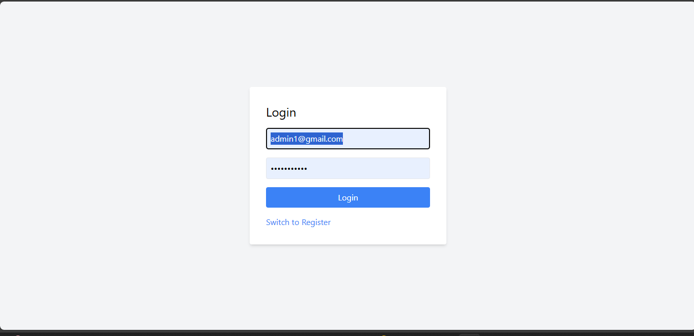
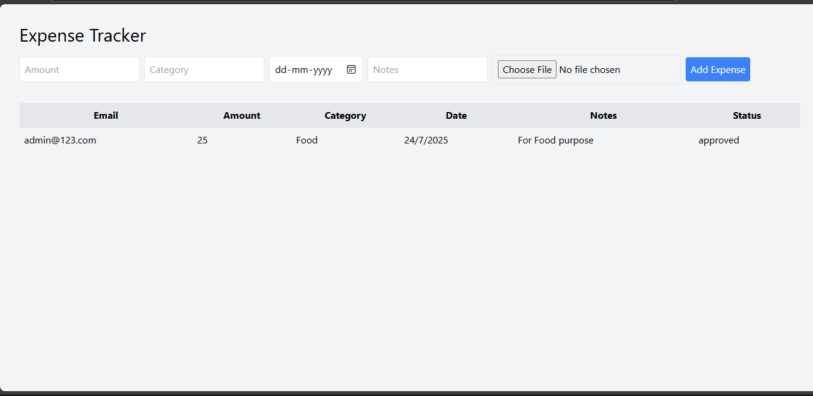
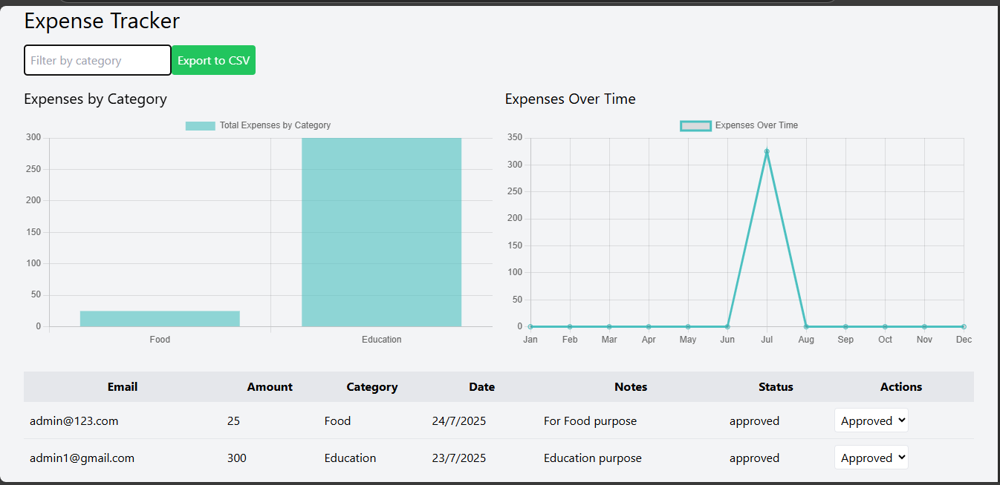

# Expense Tracker Application

## Overview

The Expense Tracker is a full-stack web application for managing employee expenses. Employees can submit expenses with receipts, and admins can review, approve, or reject them, view charts, export data to CSV, and access audit logs. The frontend is built with React, Tailwind CSS, and Chart.js, deployed on Netlify. The backend uses Node.js, Express, and MongoDB, deployed on Render.

---

## 🔥 Features

- **Authentication**: Register and log in as an employee or admin.

- **Employee Features**: Submit expenses with amount, category, date, notes, and optional receipts.

- **Admin Features**: View all expenses, filter by category, update statuses (pending, approved, rejected), view charts (bar and line), export expenses to CSV, and access audit logs.

- **Responsive Design**: Styled with Tailwind CSS for a clean, modern UI.

- **Data Visualization**: Bar chart for expenses by category and line chart for expenses over time using Chart.js.

- **Audit Logs**: Admins can view a history of expense creation and status changes.

---

## 🖼 UI Screenshots

| Login Page | Dashboard | Charts |
|------------|-----------|--------|
|  |  |  |

> Add more screenshots as needed, such as CSV export, audit logs, etc.

---

## 🛠 Tech Stack

- **Frontend**: React, React Router, Axios, Tailwind CSS, Chart.js, react-chartjs-2

- **Backend**: Node.js, Express, MongoDB, Mongoose, JWT, bcryptjs, multer, csv-writer

- **Deployment**:
  - Frontend: [Netlify](https://expense-tracker-netlify-app.netlify.app/login)
  - Backend: [Render](https://expense-tracker-backend-htcl.onrender.com/)


---

## 📁 Project Structure

expense-tracker/
├── backend/
│ ├── index.js
│ ├── .env
│ ├── package.json
│ ├── models/
│ │ ├── User.js
│ │ ├── Expense.js
│ │ ├── AuditLog.js
│ ├── middleware/
│ │ ├── auth.js
│ ├── routes/
│ │ ├── auth.js
│ │ ├── expenses.js
│ │ ├── audit.js
│ ├── uploads/
├── frontend/
│ ├── package.json
│ ├── tailwind.config.js
│ ├── src/
│ │ ├── index.js
│ │ ├── index.css
│ │ ├── App.js
│ │ ├── components/
│ │ │ ├── Login.js
│ │ │ ├── Dashboard.js
│ │ │ ├── AuditLogs.js
├── screenshots/
│ ├── login.png
│ ├── dashboard.png
│ ├── charts.png


---

## ⚙️ Prerequisites

- Node.js: Version 18 or later

- MongoDB: Local instance or MongoDB Atlas

- Netlify CLI: For frontend deployment

- Render account: For backend deployment

- Git: For version control

---

## 💻 Local Setup

### Backend Setup

```bash
cd expense-tracker/backend

npm install

Create .env file:


PORT=5000

MONGO_URI=mongodb://localhost:27017/expense-tracker

JWT_SECRET=your_jwt_secret_key

Start MongoDB if local:

mongod

Create uploads directory:


mkdir uploads

Start the backend:


npm start

Runs on: http://localhost:5000

Frontend Setup

cd expense-tracker/frontend

npm install

Ensure Tailwind is configured (tailwind.config.js, index.css).

Start frontend:

npm start

Runs on: http://localhost:3000


🧪 Testing Locally

Open http://localhost:3000

Register (as employee/admin)

Log in and access dashboard

Submit expenses, update statuses, view charts, export CSV, view logs

🚀 Deployment
Frontend (Netlify)
Push code:


cd frontend

git init

git add .

git commit -m "Initial commit"

git remote add origin <your-repo-url>

git push origin main

Deploy:

Log in to Netlify

Create new site → select GitHub repo

Build settings:

Build command: npm run build

Publish directory: build

Add environment variables if needed

Deploy and note the live URL
